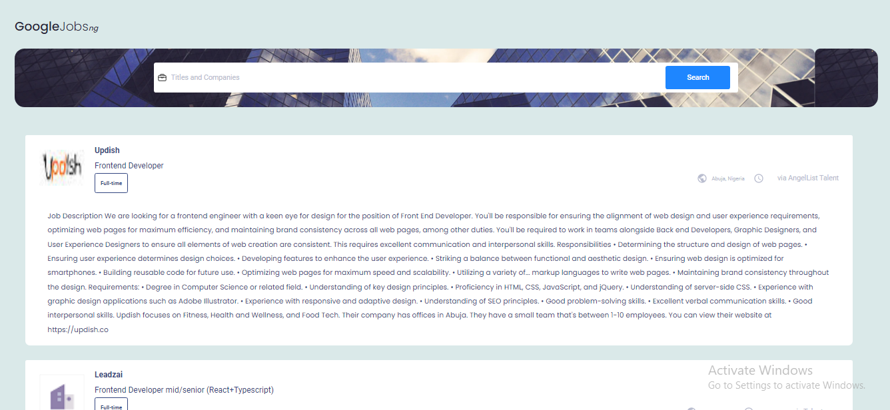

# Google Jobs Nigeria

This is an single web page app that displays jobs from nigeria. User can search for jobs using Titles and Companies. The app displays 10 jobs per page with type of jobs and the description.

## Table of contents

- [Overview](#overview)
  - [Screenshot](#screenshot)
  - [Links](#links)
  - [Built with](#built-with)
  - [What I learned](#what-i-learned)
- [Author](#author)
- [Acknowledgments](#acknowledgments)

### Overview

### Screenshot

### Links

- [Solution ](https://github.com/obinneji/Github-Jobs-App)
- [Live](https://googlejobsng.vercel.app/)

### Built with

- Flexbox
- CSS Grid
- Desktop-first workflow
- [React](https://reactjs.org/) - JS library
- [Google jobs Api](https://serpapi.com/google-jobs-api)

### What I learned
    I learnt how to use fetch api,useEffect hook, array mapping and useState hook.
    

## Author

- Website - [Obinneji chibuzor](https://obinnejichibuzor.vercel.app)
- Frontend Mentor - [@obinneji](https://www.frontendmentor.io/profile/obinneji)
- Twitter - [@francisobinneji](https://www.twitter.com/francisobinneji)

## Acknowledgments

Special acknowledgments to [frank](https://twitter.com/Osaretinfrank3)
